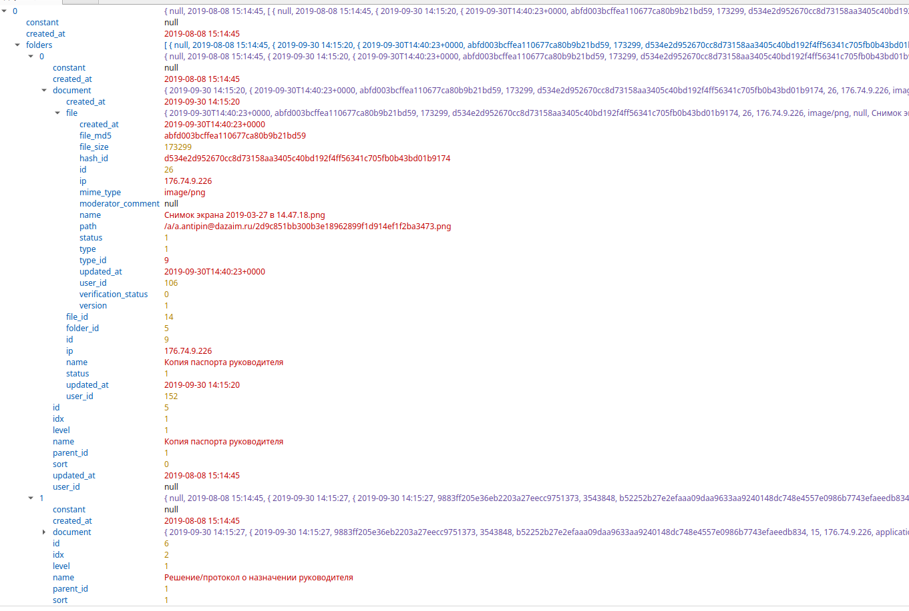

### JSON в жизни PostgreSQL

> Разворачиваем сервре с docker


- Postgres **докере**

```yaml
# postgres/docker-compose.yml:
version: '3'
services:
  
  db:
    build:
      context: .docker/postgres
    container_name: postgres_otus_db
    expose:
      - ${DB_PORT}
    ports:
      - ${DB_PORT}:5432
    environment:
      POSTGRES_DB: ${DB_DATABASE}
      POSTGRES_USER: ${DB_USERNAME}
      POSTGRES_PASSWORD: ${DB_PASSWORD}
    restart: unless-stopped
    volumes:
      - ./.docker/volumes/postgres/data:/var/lib/postgresql/data
      - ./.docker/postgres/postgresql.conf:/var/lib/postgresql/data/postgresql.conf
```

```bash
# postgres/.docker/posgres/Dockerfile:
FROM postgres:16
COPY ./pg_hba.conf /etc/postgresql/pg_hba.conf
```

```bash
### Запуск контейнера
docker-compose up --build
```

```bash
### Вход в образ
docker exec -ti postgres_otus_db bash
su - postgres
```

> Данные показывать не могу по соображению безопасности.
> Покажу запросы пользователей на одной, а package на другой более тормозной базе

#### Структура некоторых таблиц
1. Таблицы users, users_ext


> Типы phones


2. Таблицы package, package_items


> Типы package_items

- Основные документы о компании

- Документы учредителей

- Тендер


> **package** это банки в которые отправлены данные пользователя, анкеты на заявки, **package_items** сами данные для каждого банка, которые можно редактировать отдельно от каждого


> Каждая такая стркутура сохранятеся в каждой заявка и ровно такие же структуры копируются в каждый банк(их много) с последующей корректировкой под каждый банк отдельно


### Переходим к запросам. База 1 оптимизирована, 2 - нет - занижен io и параметры - заморожен проект временно

```sql
-- HASH INDEX
Seq Scan on users_ext  (cost=0.00..378.19 rows=1 width=2142) (actual time=0.011..1.073 rows=1 loops=1)
  Filter: (phones @> '["79152915353"]'::jsonb)
  Rows Removed by Filter: 1534
Planning Time: 0.389 ms
Execution Time: 1.094 ms


select pg_size_pretty(pg_relation_size('phones_ext_index'));
80kb


-- GIN INDEX
explain analyze select * from users_ext where phones @> '["79152915353"]'
Bitmap Heap Scan on users_ext  (cost=3.30..4.41 rows=1 width=2142) (actual time=0.023..0.024 rows=1 loops=1)
  Recheck Cond: (phones @> '["79152915353"]'::jsonb)
  Heap Blocks: exact=1
  ->  Bitmap Index Scan on phones_ext_index  (cost=0.00..3.30 rows=1 width=0) (actual time=0.014..0.014 rows=1 loops=1)
        Index Cond: (phones @> '["79152915353"]'::jsonb)
Planning Time: 0.122 ms
Execution Time: 0.050 ms

select pg_size_pretty(pg_relation_size('phones_ext_index'));
128kb


-- BTREE INDEX
-- REINDEX
Seq Scan on users_ext  (cost=0.00..378.19 rows=1 width=2142) (actual time=0.014..1.101 rows=1 loops=1)
  Filter: (phones @> '["79152915353"]'::jsonb)
  Rows Removed by Filter: 1534
Planning Time: 0.436 ms
Execution Time: 1.122 ms

select pg_size_pretty(pg_relation_size('phones_ext_index'));
80kb


-- DROP INDEX
-- REINDEX
Seq Scan on users_ext  (cost=0.00..378.19 rows=1 width=2142) (actual time=0.017..0.753 rows=1 loops=1)
  Filter: (phones @> '["79152915353"]'::jsonb)
  Rows Removed by Filter: 1534
Planning Time: 0.097 ms
Execution Time: 0.772 ms

```

> Видим что BTree это просто не подходит, уж лучше без индекса тогда. GIN лучше всех пока что отработал

### Перейдем к таблице где больше данных и более сложные структуры

```sql
explain analyze 
select * from public.package_items where jsonb_path_exists(package_items.data,  '$.folders[*] ? (@.document.file_id == 27)')

Seq Scan on package_items  (cost=0.00..81.33 rows=249 width=765) (actual time=0.192..8.568 rows=11 loops=1)
  Filter: jsonb_path_exists(data, '$."folders"[*]?(@."document"."file_id" == 27)'::jsonpath, '{}'::jsonb, false)
  Rows Removed by Filter: 735
Planning Time: 0.069 ms
Execution Time: 8.613 ms


-- ADD GIN INDEX
-- REINDEX
explain analyze 
select * from public.package_items where jsonb_path_exists(package_items.data,  '$.folders[*] ? (@.document.file_id == 27)')
Seq Scan on package_items  (cost=0.00..81.33 rows=249 width=765) (actual time=0.199..6.495 rows=11 loops=1)
  Filter: jsonb_path_exists(data, '$."folders"[*]?(@."document"."file_id" == 27)'::jsonpath, '{}'::jsonb, false)
  Rows Removed by Filter: 735
Planning Time: 0.075 ms
Execution Time: 6.537 ms


explain analyze 
select * from public.package_items where  type=1 and jsonb_path_exists(package_items.data,  '$.folders[*] ? (@.document.file_id == 27)') 
Seq Scan on package_items  (cost=0.00..83.19 rows=56 width=765) (actual time=0.088..3.350 rows=11 loops=1)
  Filter: (jsonb_path_exists(data, '$."folders"[*]?(@."document"."file_id" == 27)'::jsonpath, '{}'::jsonb, false) AND (type = 1))
  Rows Removed by Filter: 735
Planning Time: 0.059 ms
Execution Time: 3.382 ms


```


### Выводы
1. На слишком больших иерархиях тяжеловато индек идет. Тут или вспомогательный индекс нужен, или функциональный. 
2. Большие структуры лцчше использовать для вывода фронта, а не для выборки
3. Данные нужно одного типа деражать на одном индексе. Так лучше работает и быстрее. Например для предыдущего примера на каждый type отдельный индекс, т.к. по типу структуры отличаются
4. Структуры конролируются ПО
5. Много пока в режиме эксперемента

### Плюсы
1. Можно отказаться от ряда relations и снять нагрузку на харды
2. Структурированные типы удобны в обслуживании если заданы правила
3. Скорость разработки - как правило делается на беке обертка и через нее прогоняется. Все в одном месте
4. Возможно будущее OLAP данных (это мысли вслух)


### Минусы
1. Сыровато в понимании текущих реалей
2. Нет связей типа FK. Например есть массив значений где -то, который берется с общего справочника. При удалении нужно следить что бы и с массивов удалился
3. Большие структуры плохо индексируются
4. Нужен кнотроль структур данных. Иначе нагомзить можно


