## Работа с уровнями изоляции транзакции в PostgreSQL #1

#### Ответы на вопросы

1. Создать новый проект в Google Cloud Platform, Яндекс облако или на любых ВМ, **докере**

```yaml
# docker-compose.dev.yml:
version: "3"
services:
  db:
    build:
      context: .docker/postgres
    container_name: postgres_otus_db
    expose:
      - ${DB_PORT}
    ports:
      - ${DB_PORT}:5432
    environment:
      POSTGRES_DB: ${DB_DATABASE}
      POSTGRES_USER: ${DB_USERNAME}
      POSTGRES_PASSWORD: ${DB_PASSWORD}
    restart: unless-stopped
    volumes:
      - ./.docker/volumes/postgres/data:/var/lib/postgresql/data
```

```bash
# .docker/postgres/Dockerfile:
FROM postgres:16
COPY ./postgresql.conf /etc/postgresql/postgresql.conf
```

```bash
### Запуск контейнера
docker-compose up --build
```

```bash
### Вход в образ
docker exec -ti postgres_otus_db bash
```

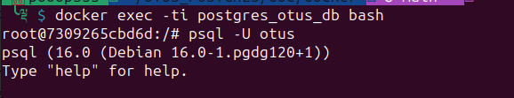

2. Выключить auto commit

```sql
\set AUTOCOMMIT off
```

3. Сделать в первой сессии новую таблицу и наполнить ее данными

```sql
create table persons(
    id serial,
    first_name text,
    second_name text
);
```

```sql
insert into persons(first_name, second_name) values('ivan', 'ivanov');
insert into persons(first_name, second_name) values('petr', 'petrov');
```

Выполняем транзакцию

```sql
commit;
```

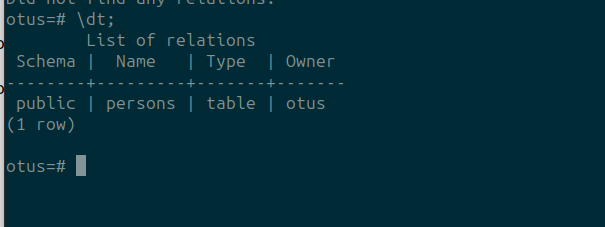

4. Посмотреть текущий уровень изоляции

```sql
show transaction isolation level
```

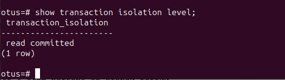

5. начать новую транзакцию в обоих сессиях с дефолтным (не меняя) уровнем изоляции

Терминал 1:
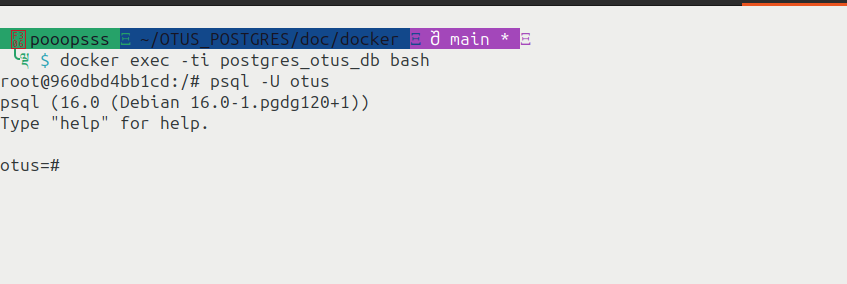

Терминал 2:
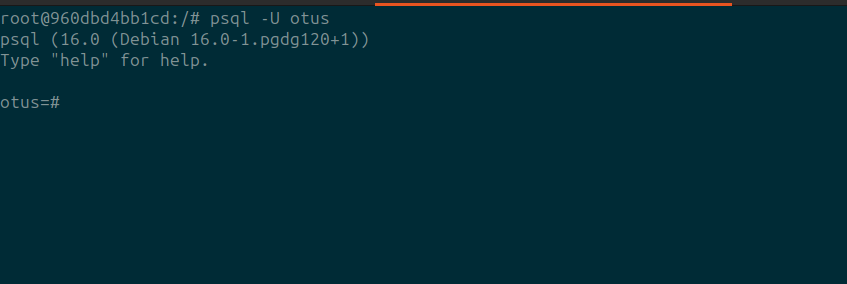

5.

```sql
-- terminal 1
insert into persons(first_name, second_name) values('sergey', 'sergeev');
```

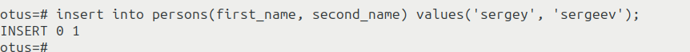

```sql
-- terminal 2
select * from persons;
```

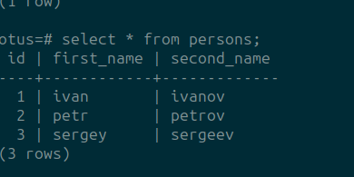

> Причина почему во втором терминале увиделось сразу после insert в первом терминале в том, что в системе настроен **autocommit on**. Он автоматически выполняет транзакцию без команды **commit** или **rollback** по символу **";"**. Поэтому когда в первом терминале выполнили команду, автоматически завершилась транзакция и второй терминал показал результат. Если бы выставили **autocommit off**, то второй терминал не увидел бы запись, если в первом не ввели бы **commit**

####Тоже самое но AUTOCOMMIT off в обеих терминалах

```sql
-- terminal 1
insert into persons(first_name, second_name) values('vasya', 'vasilevich');
```

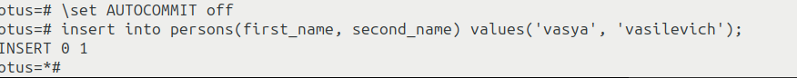

Если запросить в первом терминале

```sql
-- terminal 1
select * from persons;
```

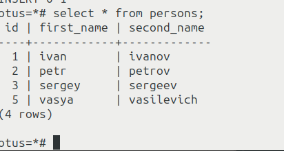

> Тут видем что в первом терминале запись вставлена

```sql
-- terminal 2
select * from persons;
```

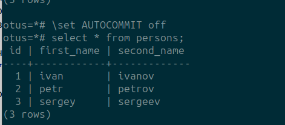

> Тут видем обратный случай, когда **autocommit off**. После Insert в первом терминале все вставилось в транзакции незавершенной первого терминала. Во втором терминали записи этой нет, т.к. транзакция не завершена еще в первом терминале (read_commited). Для завершения транзакции нужно ввести в первом терминале **commit;**, что мы и делаем

```sql
-- terminal 1
COMMIT;
```

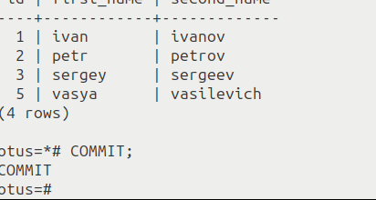

```sql
-- terminal 2
select * from persons;
```

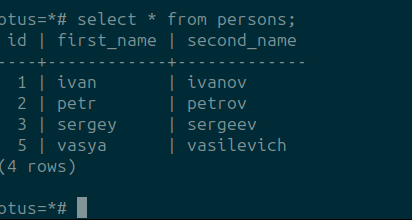

> Теперь все транзакции завершились и мы видем вставленную запись во всех сессиях.

6. Repeatable read

```sql
-- terminal 1
set transaction isolation level repeatable read;
```

```sql
-- terminal 2
set transaction isolation level repeatable read;
```

```sql
-- terminal 1
insert into persons(first_name, second_name)
values('sveta', 'svetova');
```


> Во втором терминале не видно записи вставленной в первом терминале. Т.к. режим repeatable_read, он работает как read_commited но со snapshot'ом сделанным с вначале транзакции. И даже если применить **COMMIT** в первом терминале

```sql
-- terminal 1
COMMIT;
```

> Данные в терминале 2 по select запросам будут старые на момент создания транзакции. Теперь выполним **COMMIT** во втором терминале

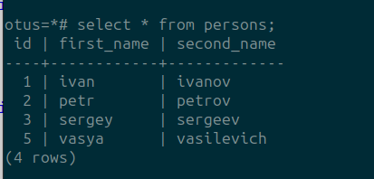

```sql
-- terminal 2
COMMIT;
```

> И теперь мы можем увидеть по команде select все изменения.

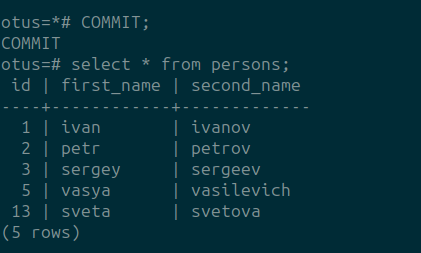
