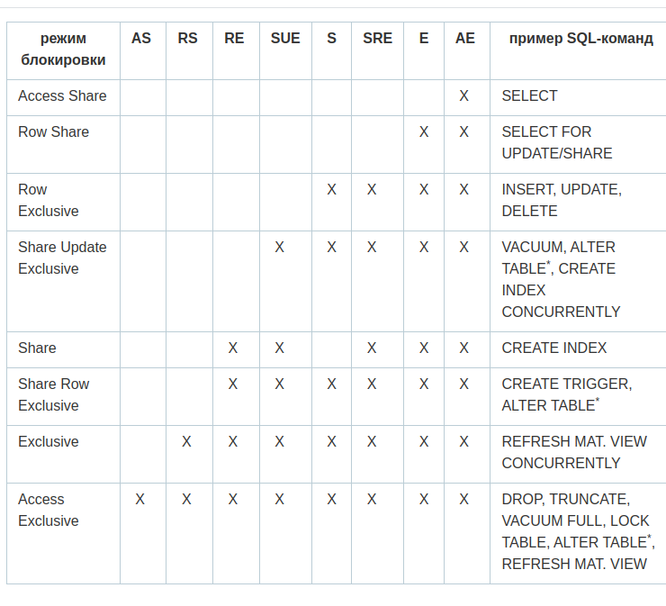

## Механизм блокировок #7


```sql
-- Включаем запись блокировок
alter system set log_lock_waits = 'on';

-- журнал сообщений сбрасывал данные о блокировках, удерживаемых более 200 миллисекунд
alter system set deadlock_timeout = '200ms';

-- Применяем настройки
select pg_reload_conf();

```

```sql
--создадим таблицу зи примера по ДЗ
CREATE TABLE accounts(
  acc_no integer PRIMARY KEY,
  amount numeric
);

-- Заблокировать можно явно открыв транзакцию в двух например сессиях и в каждой вставить запись

-- terminal 1
BEGIN;
SELECT pg_backend_pid();
 pg_backend_pid 
----------------
           1587
(1 строка)


-- Посмотреть зщаблочен или нет
SELECT locktype, relation::REGCLASS, virtualxid AS virtxid, transactionid AS xid, mode, granted
FROM pg_locks WHERE pid = 1587;
  locktype  | relation | virtxid | xid |      mode       | granted 
------------+----------+---------+-----+-----------------+---------
 relation   | pg_locks |         |     | AccessShareLock | t
 virtualxid |          | 4/66    |     | ExclusiveLock   | t
(2 строки)

```

> ExclusiveLock всегда ставиться на текущую транзакцию (виртуальную транзакцию) virtualxid.

```sql
--обнговлем запись по примеру
UPDATE accounts SET amount = amount + 100 WHERE acc_no = 1;

-- смотрим блокировки
SELECT locktype, relation::REGCLASS, virtualxid AS virtxid, transactionid AS xid, mode, granted
FROM pg_locks WHERE pid = 1587;

locktype    |   relation    | virtxid |   xid   |       mode       | granted 
---------------+---------------+---------+---------+------------------+---------
 relation      | accounts_pkey |         |         | RowExclusiveLock | t
 relation      | accounts      |         |         | RowExclusiveLock | t
 relation      | pg_locks      |         |         | AccessShareLock  | t
 virtualxid    |               | 4/66    |         | ExclusiveLock    | t
 transactionid |               |         | 2989830 | ExclusiveLock    | t


```

> Видим появились блокировки на таблицу accounts и ключ, типа RowExclusiveLock и добавился  ExclusiveLock на транзакцию transactionid. Такой идентификатор появляется у каждой транзакции потенциально меняющей состояние базы данных. Комитим.

### Режимы блокировок



### Блокировки объектов
**Типы ресурсов (столбцом locktype в pg_locks):**
• Relation — Блокировки отношений
• Transactionid — транзакция
• Virtualxid — виртуальная транзакция
• Tuple — версия строки
• Extend — добавление страниц к файлу отношения
• Object — не отношение: база данных, схема и т. п.
• Page — страница (используется некоторыми типами индексов)
• Advisory — рекомендательная блокировка

> Моделируем ситуацию трех блокировок

```sql
-- terminal 0
select * from accounts;
 acc_no | amount  
--------+---------
      1 | 1100.00
(1 строка)


-- terminal 1
begin;
select pg_backend_pid();
1587
UPDATE accounts SET amount = amount + 100 WHERE acc_no = 1;
-- terminal 2
begin;
select pg_backend_pid();
1651
UPDATE accounts SET amount = amount + 100 WHERE acc_no = 1;
-- terminal 3
begin;
select pg_backend_pid();
15192
UPDATE accounts SET amount = amount + 100 WHERE acc_no = 1;
```
> При Update первый запрос залочил таблицу. Остальные повисли в ожидании

```sql
-- terminal 0
SELECT locktype, mode, granted, pid, pg_blocking_pids(pid) AS wait_for FROM pg_locks WHERE relation = 'accounts'::regclass;

locktype |       mode       | granted |  pid  | wait_for 
----------+------------------+---------+-------+----------
 relation | RowExclusiveLock | t       | 15192 | {1651}
 relation | RowExclusiveLock | t       |  1651 | {1587}
 relation | RowExclusiveLock | t       |  1587 | {}
 tuple    | ExclusiveLock    | f       | 15192 | {1651}
 tuple    | ExclusiveLock    | t       |  1651 | {1587}

```

> RowExclusiveLock - блокировки на realtions - со связями wait_for. 1 - 1587, 2 - 1651, 3 - 15192. Как и вводили. Tuple говорит о блокировки версии строки. т.к. именно одну и туже меняли.

> ExclusiveLock(tuple|15192) - в granted - false, потому что пытаясь получить эксклюзивную блокировку натыкается на то что уже такая блокировка стоит ExclusiveLock(tuple|1651)


```sql
--terminal 1
commit;
SELECT locktype, mode, granted, pid, pg_blocking_pids(pid) AS wait_for FROM pg_locks WHERE relation = 'accounts'::regclass;
 locktype |       mode       | granted |  pid  | wait_for 
----------+------------------+---------+-------+----------
 relation | RowExclusiveLock | t       | 15192 | {1651}
 relation | RowExclusiveLock | t       |  1651 | {}
(2 строки)

--Видим что Exclusive ушли.
-- В терминале 2 автоматически отвис или снялась блокировка и можно завершать транзакцию
-- terminal 2
commit;
 locktype |       mode       | granted |  pid  | wait_for 
----------+------------------+---------+-------+----------
 relation | RowExclusiveLock | t       | 15192 | {}

-- В терминале 3 отвисла блокировка и можно завершать транзакцию 
commit;
```

> Таким образом можно посмотерть есть ли зависшие блоки и понять кто кого ждет

### Блокировка и журналы в логах файла

> Выше включили запись в журнал log_lock_waits 

```sql
show log_lock_waits ;
 log_lock_waits 
----------------
 on
(1 строка)


select pg_reload_conf();

--terminal 1
begin;
UPDATE accounts SET amount = amount + 100.00 WHERE acc_no = 1;

--terminal 2
UPDATE accounts SET amount = amount + 100.00 WHERE acc_no = 1;


--terminal 1
select pg_sleep(1);
commit;

--terminal 2
commit;
```

> Идем смотреть в файлы

```bash
tail -n 50 /var/log/postgresql/postgresql-16-main.log
СООБЩЕНИЕ:  процесс 1587 продолжает ожидать в режиме ShareLock блокировку "транзакция 2989834" в течение 200.169 мс
2023-11-15 20:14:57.437 UTC [1587] postgres@postgres ПОДРОБНОСТИ:  Process holding the lock: 1449. Wait queue: 1587.
2023-11-15 20:14:57.437 UTC [1587] postgres@postgres КОНТЕКСТ:  при изменении кортежа (0,5) в отношении "accounts"
2023-11-15 20:14:57.437 UTC [1587] postgres@postgres ОПЕРАТОР:  UPDATE accounts SET amount = amount + 100.00 WHERE acc_no = 1;
2023-11-15 20:15:47.527 UTC [1587] postgres@postgres СООБЩЕНИЕ:  процесс 1587 получил в режиме ShareLock блокировку "транзакция 2989834" через 50289.952 мс
2023-11-15 20:15:47.527 UTC [1587] postgres@postgres КОНТЕКСТ:  при изменении кортежа (0,5) в отношении "accounts"
2023-11-15 20:15:47.527 UTC [1587] postgres@postgres ОПЕРАТОР:  UPDATE accounts SET amount = amount + 100.00 WHERE acc_no = 1;
2023-11-15 20:15:54.475 UTC [825] СООБЩЕНИЕ:  начата контрольная точка: time
2023-11-15 20:15:54.607 UTC [825] СООБЩЕНИЕ:  контрольная точка завершена: записано буферов: 2 (0.0%); добавлено файлов WAL 0, удалено: 0, переработано: 0; запись=0.104 сек., синхр.=0.007 сек., всего=0.132 сек.; синхронизировано_файлов=2, самая_долгая_синхр.=0.004 сек., средняя=0.004 сек.; расстояние=0 kB, ожидалось=60 kB; lsn=0/8F7468A8, lsn redo=0/8F746870

```

> Таким образом можно проследить в файле если включен параметр log_lock_waits и транзакции была больше чем параметр deadlock_timeout

### Взаимоблокировка трех транзакций

```sql
select * from accounts;
 acc_no | amount  
--------+---------
      1 | 1600.00
      2 | 2000.00
      3 | 3000.00
(3 строки)


--termianl 1
begin;
UPDATE accounts SET amount = amount - 100.00 WHERE acc_no = 1;

--terminal 2
begin;
UPDATE accounts SET amount = amount - 100.00 WHERE acc_no = 2;

--terminal 3
begin;
UPDATE accounts SET amount = amount - 100.00 WHERE acc_no = 1;

--termianl 1
UPDATE accounts SET amount = amount + 1000.00 WHERE acc_no = 3;

--termainal 2
UPDATE accounts SET amount = amount + 1000.00 WHERE acc_no = 1;

--termainal 3
UPDATE accounts SET amount = amount + 1000.00 WHERE acc_no = 2;

ОШИБКА:  обнаружена взаимоблокировка
ПОДРОБНОСТИ:  Процесс 1651 ожидает в режиме ShareLock блокировку "транзакция 2989840"; заблокирован процессом 1587.
Процесс 1587 ожидает в режиме ShareLock блокировку "транзакция 2989839"; заблокирован процессом 15391.
Процесс 15391 ожидает в режиме ShareLock блокировку "транзакция 2989842"; заблокирован процессом 1651.
ПОДСКАЗКА:  Подробности запроса смотрите в протоколе сервера.
КОНТЕКСТ:  при изменении кортежа (0,8) в отношении "accounts"

```

### Могут ли две транзакции, выполняющие единственную команду UPDATE одной и той же таблицы (без where), заблокировать друг друга?

> Могут если попадется перекресная блокировка. Т.к. происходин на уровне строк tuple каждая строка помеячается и могут возникнуть, а могут и не возникнуть когда пока одна будет проходить - вторая блокирнет. Возможн в асинхронном режиме кстати.

